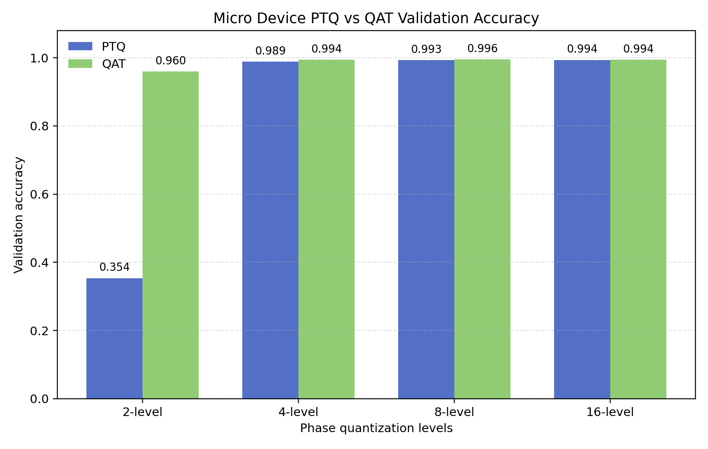
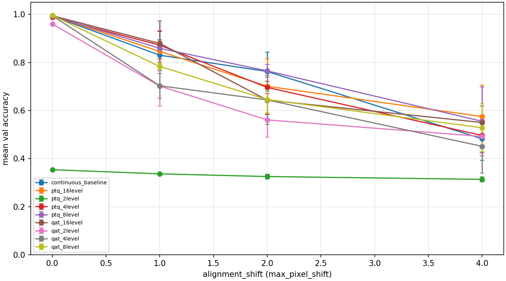
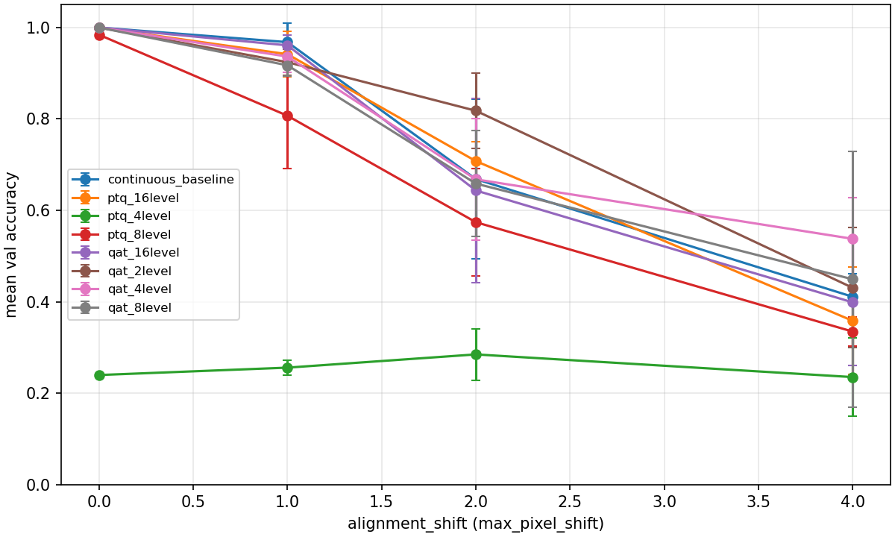
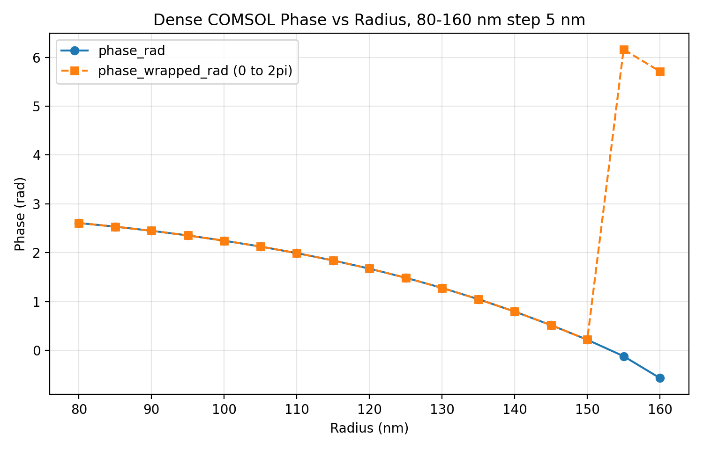
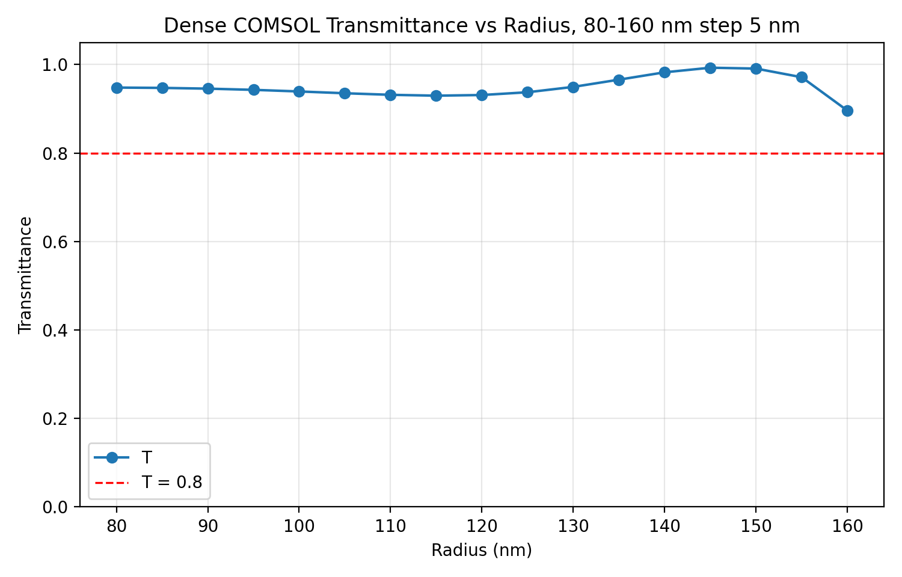
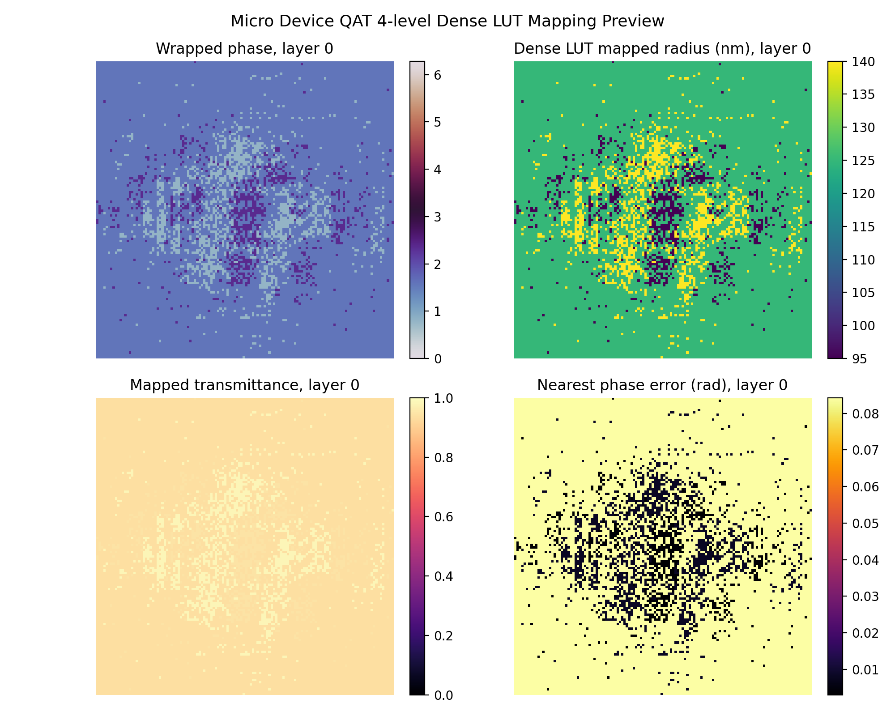

# VCSEL-D2NN-Metasurface

Hardware-aware diffractive deep neural network simulation for VCSEL near-field and micro-device classification, with PTQ/QAT evaluation, robustness analysis, COMSOL meta-atom lookup tables, and phase-to-radius structural mapping.

> **Scope:** This repository contains algorithm simulations, COMSOL unit-cell simulation results, and a phase-to-radius structural mapping preview. It does **not** report fabricated hardware, experimental measurements, or a fabrication-ready design.

## Project Overview

This undergraduate research project connects optical classification and metasurface-oriented structural mapping:

- VCSEL near-field mode classification with a phase-only D2NN.
- Five-class synthetic micro-device pattern classification.
- Post-training quantization (PTQ) and quantization-aware training (QAT) at 2/4/8/16 phase levels.
- Hardware-aware evaluation under phase noise, height noise, and inter-layer alignment shift.
- COMSOL meta-atom radius sweeps and phase-radius LUT construction.
- Nearest circular-phase matching from quantized phase maps to pillar radii.

## Pipeline

```text
Synthetic optical/device data
        -> phase-only D2NN baseline
        -> PTQ / QAT
        -> phase, height and alignment robustness
        -> COMSOL unit-cell phase-radius LUT
        -> phase-to-radius structural preview
```

An overall pipeline figure was not included because no verified source image was available in the original project directory.

## Main Results

| Task | Method | Validation accuracy |
|---|---|---:|
| Micro-device classification | Continuous-phase baseline | 99.30% |
| Micro-device classification | 2-level PTQ | 35.37% |
| Micro-device classification | 2-level QAT | 96.00% |
| Micro-device classification | 4-level QAT | 99.43% |
| Micro-device classification | 8-level QAT | **99.57%** |
| Micro-device classification | 16-level QAT | 99.43% |

The largest low-bit improvement is observed at 2 levels: QAT raises validation accuracy from `0.353667` to `0.960000`.



## Hardware-aware Evaluation

The robustness study evaluates three simulated perturbations:

- Gaussian phase noise.
- Etch-height noise.
- Random inter-layer alignment shift.

Among the tested perturbations, **alignment shift is the primary bottleneck**. For the micro-device continuous baseline, the recorded mean accuracy falls from `0.993000` at 0 px to `0.830067`, `0.762267`, and `0.482200` at 1, 2, and 4 px, respectively.

| Micro-device alignment sensitivity | VCSEL alignment sensitivity |
|---|---|
|  |  |

## COMSOL Meta-atom Simulation

The dense unit-cell sweep covers pillar radii from **80 to 160 nm** with a **5 nm** step and **17 samples**. The wrapped phase spans `0.21656-6.16256 rad`, corresponding to approximately **94.6% of 2π**. All sampled points satisfy `T >= 0.8`.

| Wrapped phase response | Transmittance response |
|---|---|
|  |  |

The exported COMSOL `.mph` model is intentionally not included because of file size and environment-specific dependencies. The repository provides the lightweight CSV, PNG, and Markdown post-processing artifacts.

## Phase-to-Radius Mapping

The dense mapping converts a quantized phase map with shape **3 × 128 × 128** to four selected radii: **95, 125, 140, and 155 nm**. The mean mapped transmittance is `0.946660`, and the low-transmittance ratio at threshold `T < 0.8` is `0`.



This nearest-phase mapping is a structural preview. It does not model neighboring-cell coupling, full-array electromagnetic response, layout design rules, or fabrication tolerances.

## Repository Structure

```text
VCSEL-D2NN-Metasurface/
|-- README.md
|-- README_PROJECT_CN.md
|-- requirements.txt
|-- project_paths.py
|-- check_project_status.py
|-- run_reproduce_summary.py
|-- map_phase_to_radius.py
|-- build_result_index.py
|-- scripts/                 # training, PTQ/QAT, robustness and COMSOL post-processing
|-- tests/                   # engineering and release-layout checks
|-- reports/                 # concise verified reports
|-- assets/                  # selected figures for results and presentation
`-- comsol_results/          # lightweight LUT CSV/PNG/Markdown artifacts
```

## Reproduction

Install dependencies:

```bash
pip install -r requirements.txt
```

The repository does not include datasets, checkpoints, or full `outputs/`. After placing those artifacts in the paths described in [README_PROJECT_CN.md](README_PROJECT_CN.md), run:

```bash
python check_project_status.py
python run_reproduce_summary.py
```

Run a phase-to-radius mapping with an existing quantized phase map:

```bash
python map_phase_to_radius.py \
  --phase-map outputs/micro_device_qat/4level/quantized_phase_map.npy \
  --lut comsol_results/phase_radius_lut_dense.csv \
  --output-dir comsol_results/mapped_micro_device_4level_dense_unified \
  --label "Micro Device 4-level Dense LUT" \
  --low-t-threshold 0.8
```

Training and evaluation entry points are documented in [`scripts/`](scripts/). Running training scripts is not required to inspect the released results.

## Current Limitations

- The classification datasets are synthetic or simulated.
- Robustness results are algorithm-level perturbation simulations.
- COMSOL results describe meta-atom unit cells, not a full 128 × 128 array simulation.
- No device has been fabricated, and no experimental optical measurement is reported.
- The phase-to-radius map is a structural preview, not a fabrication-ready layout.

## Future Work

- Alignment-aware training and tolerance optimization.
- Broader multi-parameter COMSOL optimization for phase coverage and transmission.
- Incorporation of fabrication constraints and neighboring-cell coupling.
- Experimental fabrication, optical characterization, and simulation-to-hardware validation.

## Further Reading

- [Verified results summary](reports/RESULTS_SUMMARY.md)
- [Chinese project guide](README_PROJECT_CN.md)
- [Stage summary](reports/code_stage_summary_cn.md)
- [GitHub release audit](GITHUB_RELEASE_CHECK.md)
